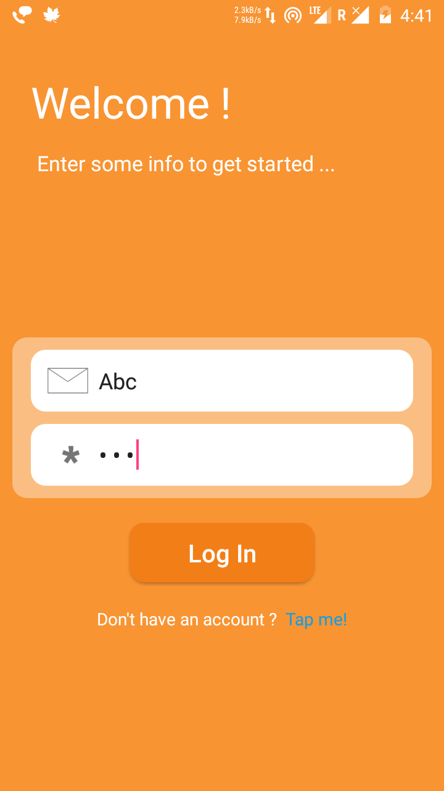
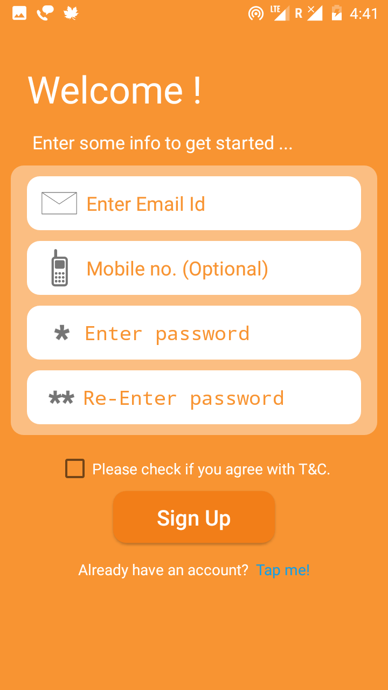
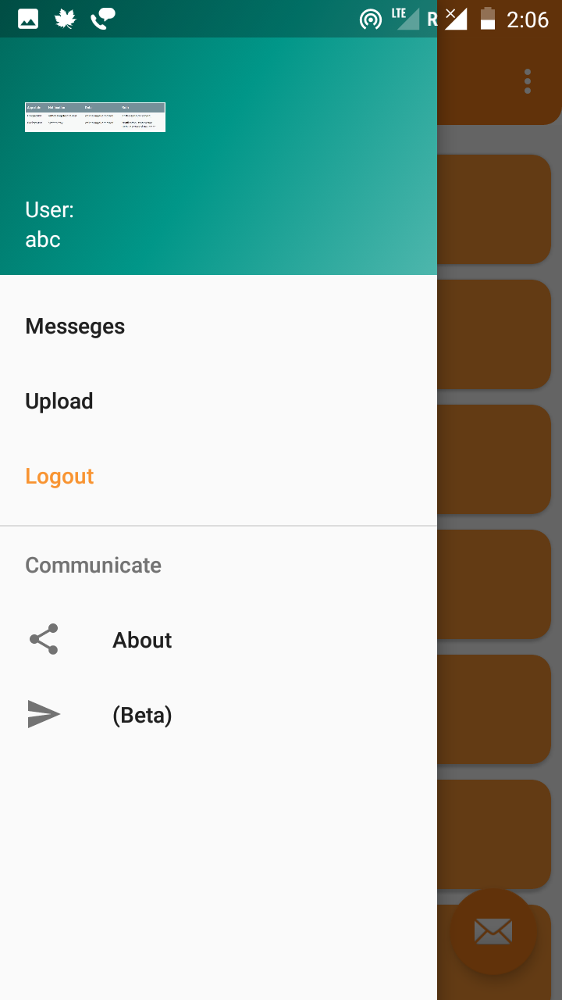
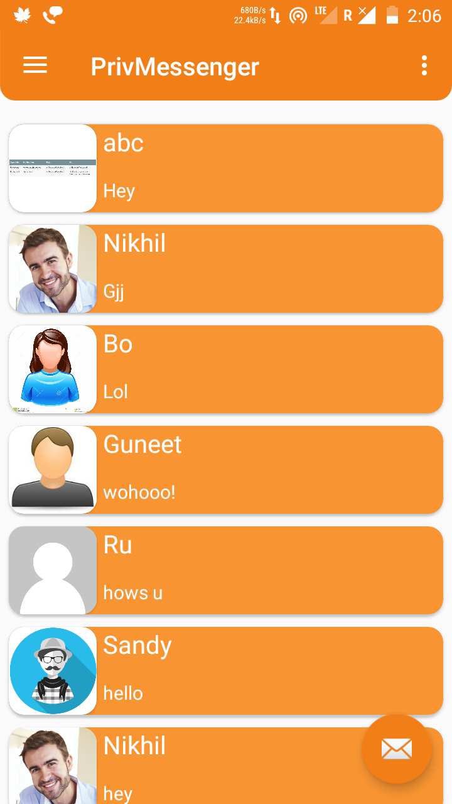
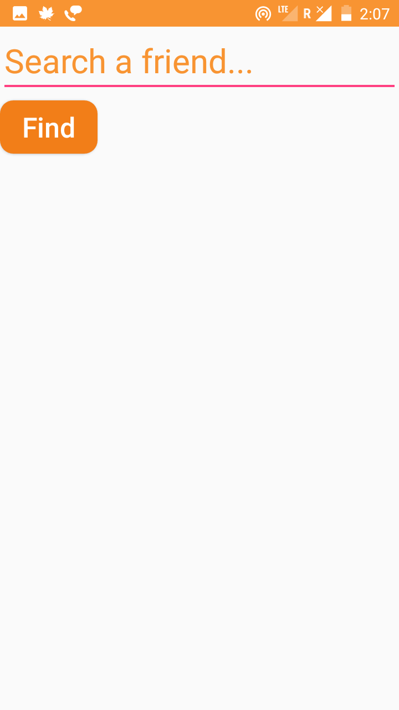
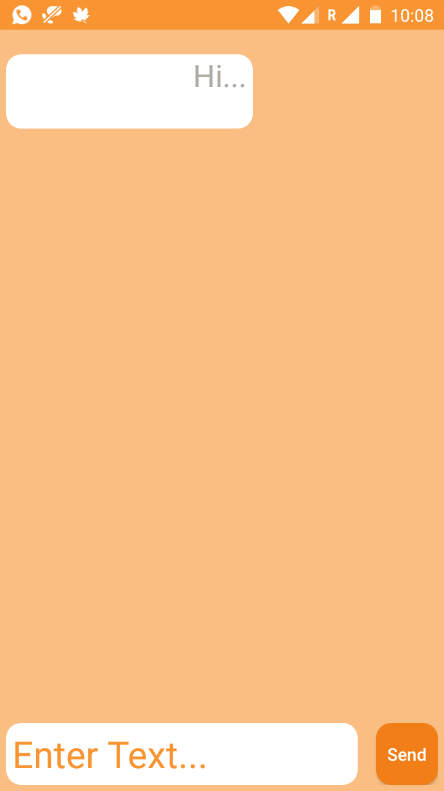

# PrivMessenger-android
You can clone this project and and make use of it. To make it work all you need to do is generate 'google-services.json' (containing the the key and details of your project in Firebase project)
by creating a project at https://console.cloud.google.com/projectcreate and pasting the 'google-services.json' in the root directory of this project.

You must also want to check the value/string.xml file as there I have made some constants that are used in the app to make it work(e.g. urls).

You suggestions/workaround will be greatly appriciated.

Also I'll be right there for a quick reply.

Thanks for watching!

Screenshots:

LoginFragment:

SignUpFragment:

Navigation Panel:

MainAfLogin(Conversations):

NewMsg:

Chat:

UploadFragment:

